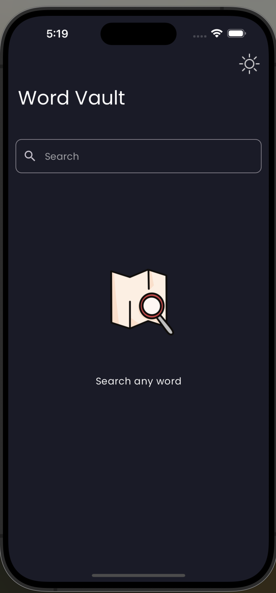
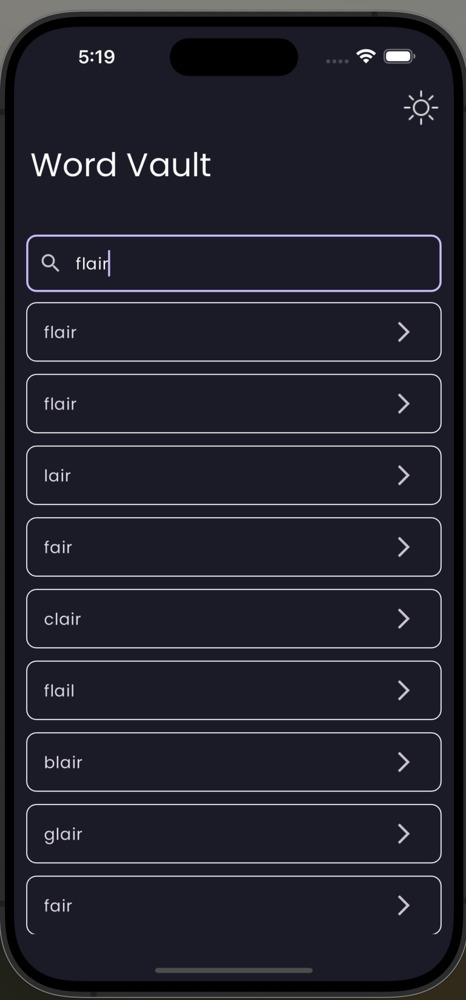
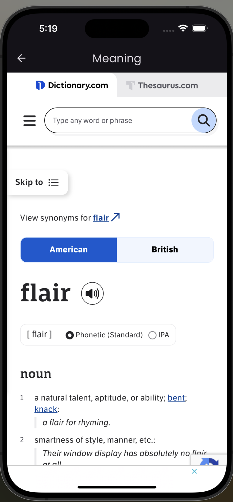

# WordVault 📚

WordVault is your go-to dictionary app for finding the meaning of any word instantly with just a tap. Whether you're a student, writer, or simply curious, WordVault makes it easy to expand your vocabulary and understand the meaning of words quickly.

## Features ✨

- **Instant Search**: Get word meanings at your fingertips.
- **User-Friendly Interface**: Simple and clean design for easy navigation.
- **Comprehensive Word Database**: Access a wide range of words and their meanings.
- **Favorites**: Save your favorite words for quick reference.
- **Recent Searches**: Quickly access your recent word lookups. [Upcoming]
- **Offline Access**: Search word meanings even when you're offline. [Upcoming]
- **Speech Search**: Search word meanings without typeing. [Upcoming]

## How It Works 🛠️

1. Open the app.
2. Type the word you want to search.
3. Instantly get the meaning and additional details.
4. Add the word to your favorites or view recent searches.

## ScreenShots

